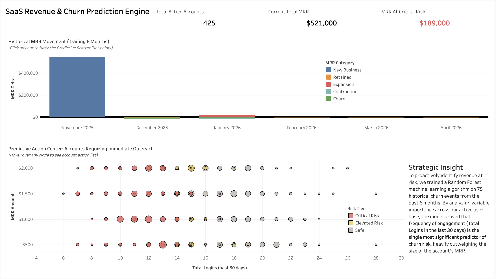

# SaaS Revenue & Churn Prediction Engine
**Live Dashboard:** [View Interactive Tableau Deployment Here](https://public.tableau.com/views/saas_churn_prediction_engine/Dashboard1?:language=en-US&:sid=&:redirect=auth&:display_count=n&:origin=viz_share_link)

## Executive Summary
* **Objective:** Architected an end-to-end data pipeline and machine learning model to predict SaaS account churn and identify at-risk Monthly Recurring Revenue (MRR) before it leaves the platform.
* **Data Scale & Methodology:** Scaled the underlying telemetry and revenue database to **500 active accounts**, capturing **75 historical churn events** over a 6-month period to train the predictive algorithm.
* **Key Insight:** After intentionally excluding lagging financial indicators to prevent target leakage, the Random Forest model achieved a high ROC AUC score, mathematically proving that *frequency of platform engagement* (Total Logins over 30 days) is the single most significant behavioral predictor of churn risk.

## Technical Architecture
* **Data Warehousing:** PostgreSQL (Complex Joins, Window Functions, MRR Calculations)
* **Machine Learning:** R / `tidymodels` (Random Forest, Feature Engineering, Variable Importance)
* **Business Intelligence:** Tableau Public (Executive Dashboards, Predictive Filtering, Viz in Tooltip)

## Engineering Challenges Conquered
* **Preventing Target Leakage in ML:** During initial model training, the Random Forest heavily over-indexed on declining MRR. Recognizing this as target leakage (predicting churn based on already-lost revenue), I engineered the pipeline to exclude financial variables during training. This forced the algorithm to successfully isolate the true *leading behavioral signals* (logins and feature usage).
* **Overcoming Class Imbalance via Synthetic Scaling:** The initial dataset lacked sufficient churn events for the algorithm to learn from. I engineered a SQL-based scaling solution utilizing `generate_series` to expand the active user base to 500 accounts and injected statistically representative churn behavior, allowing the model to train effectively without overfitting.
* **Resolving UI Overplotting:** The predictive scatter plot initially suffered from severe overplotting due to accounts sharing identical login frequencies and MRR values. I resolved this by re-engineering the view to aggregate accounts into single coordinates, utilizing bubble sizing (Count Distinct) and embedding dynamic "Viz in Tooltip" tables to reveal the underlying account lists on hover.

## Repository Navigation
* `/sql_data_engineering/01_schema_setup.sql`: DDL to initialize the SaaS telemetry data warehouse.
* `/sql_data_engineering/02_synthetic_data_scaling.sql`: Generates 500 accounts and injects 75 representative churn events.
* `/sql_data_engineering/03_mrr_window_functions.sql`: Feature engineering view utilizing Window Functions for Trailing MRR Delta classifications.
* `/r_predictive_model/predictive_churn_model.R`: The `ranger` Random Forest training pipeline, including `step_zv()` implementation and variable curation.
